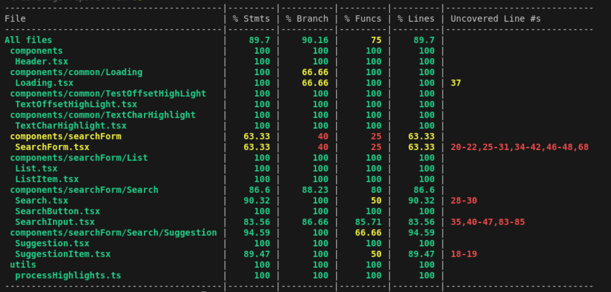

# Project Name

## Index

-   [Live Deployed Link](#live-deployed-link)
-   [How to Run Locally](#how-to-run-locally)
    -   [Run with Docker](#run-with-docker)
    -   [Run with NodeJS](#run-with-nodejs)
-   [How to Run Automated Tests](#how-to-run-automated-tests)
-   [Test Coverage Evidences](#test-coverage-evidences)

---

## Live Deployed Link

You can access the live version of the project here: [Live Deployment](#)

---

## How to Run Locally

1. Clone the repository:
    ```sh
    git clone git@github.com:dienphamvan/mini_search_app_v2.git
    cd mini_search_app_v2
    ```
2. Make a copy of .env.example and rename it to .env (you can do it manually or by running the following command):
    ```sh
    cp .env.example .env
    ```

### Run with Docker

1. Ensure you have [Docker](https://www.docker.com/) installed.
2. Build and run the container:

    ```sh
    docker build -t mini_search_app .
    ```

    ```sh
    docker run -d -p 3001:3000 --name mini_search_app mini_search_app
    ```

3. The application should now be accessible at `http://localhost:3001`

4. Clean up the container and image:

    ```sh
    docker stop mini_search_app
    ```

    ```sh
    docker rm mini_search_app
    ```

    ```sh
    docker rmi mini_search_app
    ```

### Run with NodeJS

1. Ensure you have [Node.js](https://nodejs.org/) installed.
2. Install dependencies:
    ```sh
    npm install
    ```
3. Start the application:

    ```sh
    npm run build
    ```

    ```sh
    npm run start
    ```

4. The application should now be accessible at `http://localhost:3000`

_Note: You can also run the application in development mode using `npm run dev`._

---

## How to Run Automated Tests

Ensure that Node.js is installed and dependencies are installed (npm install).
To execute the automated tests, use the following command:

```sh
npm run test
```

For a detailed report, run:

```sh
npm run test:coverage
```

---

## Test Coverage Evidences

<!-- Image from public folder -->


