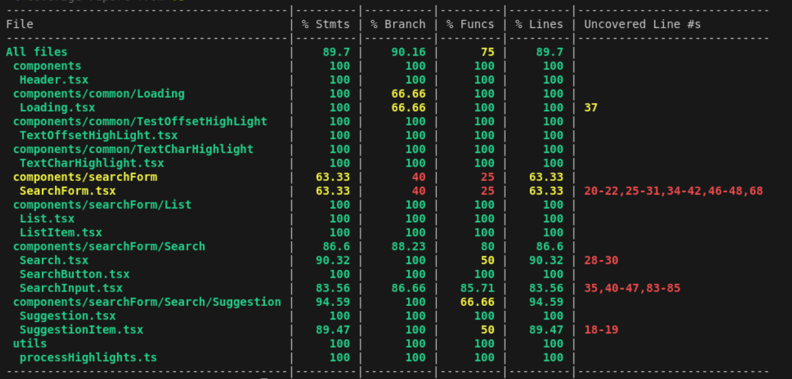
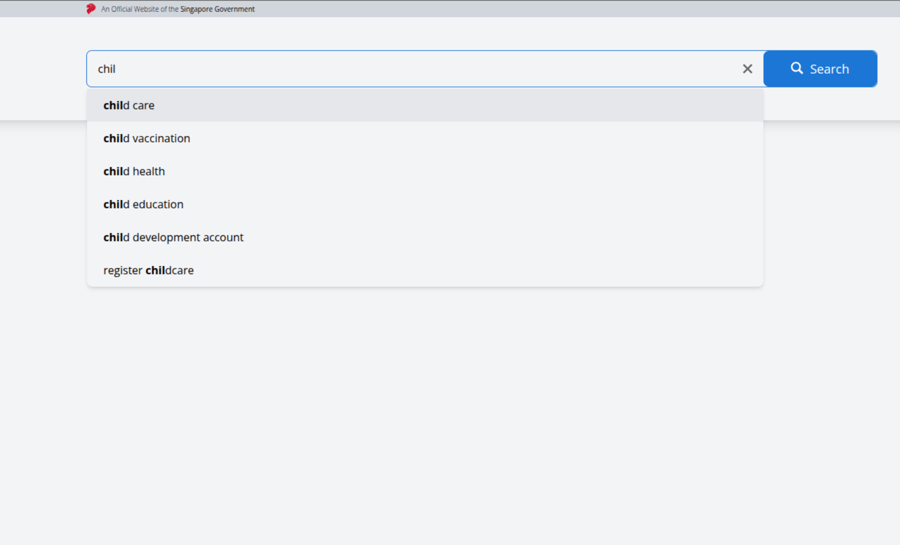
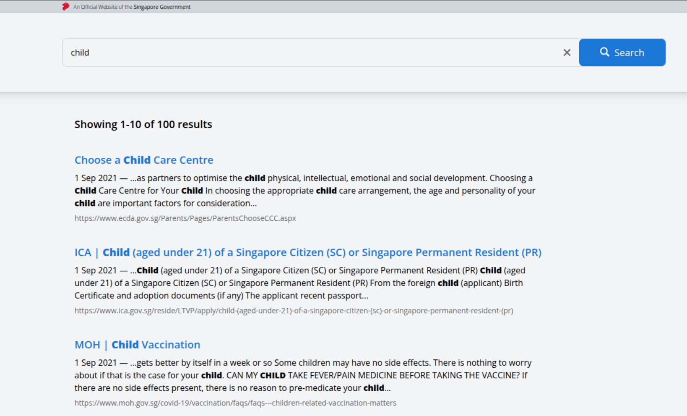

# Web Developer Interview

## Table of content

- [Live Deployed Link](#live-deployed-link)
- [Project Structure](#project-structure)
- [How to Run Locally](#how-to-run-locally)
  - [Run with Docker](#run-with-docker)
  - [Run with NodeJS](#run-with-nodejs)
- [How to Run Automated Tests](#how-to-run-automated-tests)
- [Technologies Used](#technologies-used)
- [Preview](#preview)


---

## Live Deployed Link

You can access the live version of the project here: [Live Deployment](https://mini-search-app.netlify.app/)

---

---

## Project Structure

The project is structured as follows:

```bash
app
├── app.css
├── components
│   ├── common
│   │   ├── icons
│   │   │   ├── CrossIcon.tsx
│   │   │   ├── LionIcon.tsx
│   │   │   ├── SearchIcon.tsx
│   │   │   └── SpinIcon.tsx
│   │   ├── Loading
│   │   │   ├── Loading.test.tsx
│   │   │   └── Loading.tsx
│   │   ├── TestOffsetHighLight
│   │   │   ├── TestOffsetHighLight.test.tsx
│   │   │   └── TextOffsetHighLight.tsx
│   │   └── TextCharHighlight
│   │       ├── TextCharHighlight.test.tsx
│   │       └── TextCharHighlight.tsx
│   ├── Header.test.tsx
│   ├── Header.tsx
│   └── searchForm
│       ├── List
│       │   ├── ListItem.test.tsx
│       │   ├── ListItem.tsx
│       │   ├── List.test.tsx
│       │   └── List.tsx
│       ├── Search
│       │   ├── SearchButton.tsx
│       │   ├── SearchInput.test.tsx
│       │   ├── SearchInput.tsx
│       │   ├── Search.tsx
│       │   └── Suggestion
│       │       ├── SuggestionItem.tsx
│       │       └── Suggestion.tsx
│       ├── SearchForm.test.tsx
│       └── SearchForm.tsx
├── pages
│   └── HomePage.tsx
├── root.tsx
├── routes
│   └── home.tsx
├── routes.ts
├── service
│   ├── searchService.test.ts
│   ├── searchService.ts
│   ├── suggestService.test.ts
│   └── suggestService.ts
├── structure.txt
├── types
│   └── index.ts
└── utils
    ├── processHighlights.test.ts
    └── processHighlights.ts
```


## How to Run Locally

1. Clone the repository:
    ```sh
    git clone git@github.com:dienphamvan/mini_search_app_v2.git
    cd mini_search_app_v2
    ```
2. Make a copy of .env.example and rename it to .env (you can do it manually or by running the following command):
    ```sh
    cp .env.example .env
    ```

#### Run with Docker

1. Ensure you have [Docker](https://www.docker.com/) installed.
2. Build and run the container:

    ```sh
    docker build -t mini_search_app .
    ```
    _Note: Above command will build the image with the name `mini_search_app`._

    ```sh
    docker run -d -p 3001:3000 --name mini_search_app mini_search_app
    ```
    _Note: Above command will run the container with the name `mini_search_app` and expose the application on port 3001._

3. The application should now be accessible at `http://localhost:3001`

4. Clean up the container and image:

    ```sh
    docker stop mini_search_app
    ```

    ```sh
    docker rm mini_search_app
    ```

    ```sh
    docker rmi mini_search_app
    ```

#### Run with NodeJS

1. Ensure you have [Node.js](https://nodejs.org/) installed.
2. Install dependencies:
    ```sh
    npm install
    ```
3. Start the application:

    ```sh
    npm run build
    ```

    ```sh
    npm run start
    ```

4. The application should now be accessible at `http://localhost:3000`

_Note: You can also run the application in development mode using `npm run dev`._

---

## How to Run Automated Tests

1. Ensure that Node.js is installed and dependencies are installed (npm install).
2. To execute the automated tests, use the following command:

```sh
npm run test
```

For a detailed report, run:

```sh
npm run test:coverage
```


---

## Technologies Used
- Frontend: React, TypeScript, Tailwind CSS
- Build Tool: Vite
- Testing: Vitest, React Testing Library

## Preview
Suggestions Feature


Search Result
